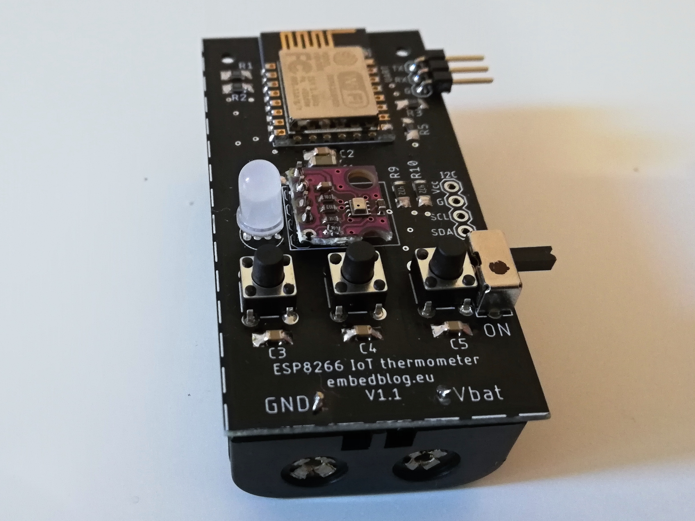

# ESP8266 ultra low power thermometer
*see the article [here](http://embedblog.eu/?p=36)*

## Specs
1. Arduino-compatible
2. lasts more than 2 years on a pair of AA batteries
3. measures temperature and pressure (BMP280) OR temperature, humidity and pressure (BME280)
4. transmits data regularly to Blynk (or other platform, if you program it for it)
5. can be programmed with just a simple USB-Serial converter

## Required libraries
* [ESP8266 core](https://github.com/esp8266/Arduino)
* [Blynk library](https://github.com/blynkkk/blynk-library)
* [BMP280 library](https://github.com/mahfuz195/BMP280-Arduino-Library)

